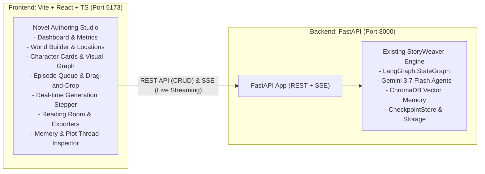

# Refactor Plan: Vite + React + TypeScript & FastAPI Backend

This directory contains the detailed engineering specifications for transitioning StoryWeaver's user interface from Streamlit to a modern, decoupled **Vite + React + TypeScript** web application powered by a **FastAPI** backend.

---

## Architecture Overview

---

## Phase Documents

| Phase | Title | Document | Description |
| :---: | :--- | :--- | :--- |
| **1** | **FastAPI Backend Layer** | [phase_1_fastapi_backend.md](file:///c:/Users/mrsim/make-story/implementation_plan/refactor_to_vite_fastapi/phase_1_fastapi_backend.md) | REST endpoints, Server-Sent Events (SSE) streaming for generation, OpenAPI docs. |
| **2** | **Frontend Foundation** | [phase_2_frontend_foundation.md](file:///c:/Users/mrsim/make-story/implementation_plan/refactor_to_vite_fastapi/phase_2_frontend_foundation.md) | Vite + React + TS bootstrap, dark-mode design system, TypeScript models, API client, SSE hook. |
| **3** | **World & Character Studio** | [phase_3_world_and_characters.md](file:///c:/Users/mrsim/make-story/implementation_plan/refactor_to_vite_fastapi/phase_3_world_and_characters.md) | World overview/rules/location hierarchy, character cards, interactive network graph. |
| **4** | **Episode Studio & Generation** | [phase_4_episode_studio.md](file:///c:/Users/mrsim/make-story/implementation_plan/refactor_to_vite_fastapi/phase_4_episode_studio.md) | Episode queue reordering, outline manager, live SSE generation stepper & dynamic checklist. |
| **5** | **Reading Room & Memory** | [phase_5_reading_room_and_memory.md](file:///c:/Users/mrsim/make-story/implementation_plan/refactor_to_vite_fastapi/phase_5_reading_room_and_memory.md) | Novel typography reader, inline editor, docx/zip export, plot thread ("떡밥") tracker, vector search. |
| **6** | **Integration & Tooling** | [phase_6_integration_and_tooling.md](file:///c:/Users/mrsim/make-story/implementation_plan/refactor_to_vite_fastapi/phase_6_integration_and_tooling.md) | Unified `scripts/dev.py` runner, production build static mounting, full E2E acceptance checklist. |

---

## Key Principles

1. **Zero Breaking Changes to Agent Core**: LangGraph orchestration, prompts, Gemini LLM bindings, ChromaDB embeddings, and checkpoint durable writes remain untouched.
2. **Coexistence**: The existing Streamlit interface in `src/storyweaver/ui/` is preserved and can run alongside the new frontend.
3. **Reactive & Desktop-grade UX**: Eliminates Streamlit's full-page rerun delays and enables interactive canvas network graphs, drag-and-drop queues, and real-time generation streaming.
